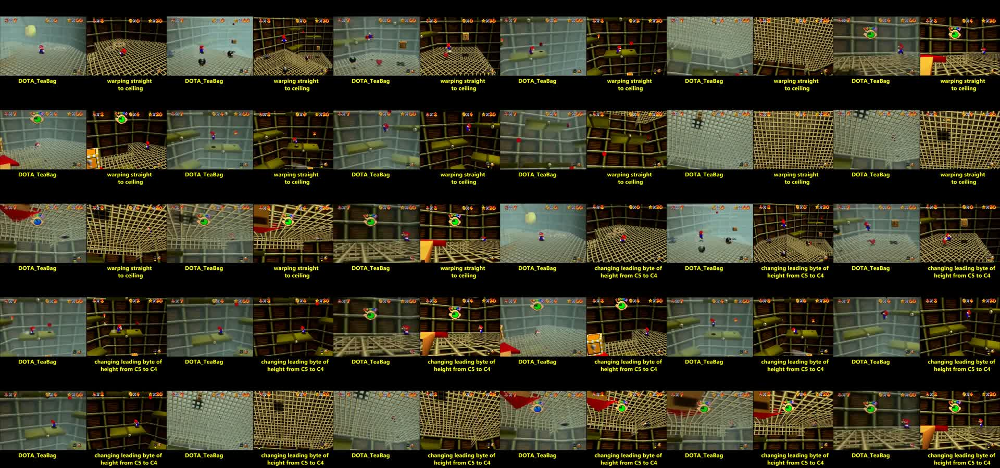

# Tick Tock Clock Upwarp Investigation

This repository contains the evidence, tooling, raw search output, and bounded technical analysis of [DOTA_Teabag's 2013 Super Mario 64 Tick Tock Clock upwarp](https://www.youtube.com/watch?v=bhBf5crp0i8).

**Verdict:** changing Mario's 32-bit Y coordinate from `0xC5837800` (`-4207.0`) to `0xC4837800` (`-1051.75`) is the strongest conditional reconstruction of the published displacement. It clears `0x01000000`, divides Y by four, and raises the synthetic state by exactly `3155.25` units. No incident RAM capture directly establishes either word, and the historical state and cause remain unsolved.

**This is not a bounty claim.** No normal-gameplay trigger or start-to-finish `.m64` was found.

**Local reconstruction (2026-09-22):** the former `roach` research host was
lost without a backup; `quag` is its replacement. References below to assets
retained on the research host describe the historical checkpoint, not current
availability. The [local setup](#re-running-the-artifacts) rebuilds the tools
and recoverable inputs without contacting that host.



## Result

| Property | Conditional reconstruction |
| --- | ---: |
| Pre-event Y | `-4207.0` (`0xC5837800`) |
| Post-event Y | `-1051.75` (`0xC4837800`) |
| XOR | `0x01000000` |
| Instantaneous rise | `3155.25` units |
| Source action | `ACT_FREEFALL` (`0x0100088C`) |
| TTC speed | Stopped |
| Recomputed floor / ceiling | `-2487.0` / `-173.0` |
| Upper landing | Y `-2487.0`, 24 game updates after the first post-mutation physics step |

In the synthetic injected state, the mutation matched both the instrumented N64 emulator and Wafel on the first physics step: Y `-1071.75`, vertical velocity `-24.0`, floor `-2487.0`, and ceiling `-173.0`. The complete synthetic fall then landed on the upper platform with matching timing.

The no-mutation control remained on the lower route and landed at Y `-5211.0`.

## What was checked

### Matched game source

The Japanese decompilation was built byte-identically to the tested ROM. The combined source reviews now enumerate these Mario coordinate and graphical-Y writer families:

- normal airborne integration and floor collision;
- ledge grabs and ceiling hangs;
- ground-pound startup;
- moving and retained platforms;
- object, pole, cannon, whirlpool, and attachment snaps;
- warps, spawns, cutscenes, and area initialization;
- raw coordinate writes observed during native tracing;
- the floor-null graphical-position fallback and every matched-source Mario graphical-Y writer found in the fresh audit.

For the reconstructed `ACT_FREEFALL` input, the airborne path cannot invoke the ceiling-hang snap. Ledge placement is bounded to 160 units above the query, ground-pound startup adds at most 20 units, and the stopped-spinner model contributes exactly zero vertical platform displacement. The retained-platform analysis found no stale-slot reuse path in its tested grid.

A fresh source review found an omitted legal propagation path in `update_mario_geometry_inputs`: when `find_floor` returns `NULL`, the game copies `marioObj->header.gfx.pos` into `MarioState.pos` before querying the floor again. Static analysis found no TTC-native writer that can leave graphical Y approximately `3155.25` units above physical Y. TTC moving surfaces update their own graphics, platform displacement updates `MarioState`, shell-only offsets are `+42` or `+45`, and TTC has no water for the `+60` pitch offset or sub-`148` type-level swim-bob bound. The remaining independent graphical writers are a non-TTC renderer `prevObj`/flame transform and an ending-Peach-cutscene assignment.

A runtime trampoline then counted the compiled JP libsm64 branch itself. A synthetic positive control copied an injected graphical Y of `-1051.75` over an out-of-bounds physical Y of `-4207.0`, then produced Y `-1071.75` after one physics update: a `3135.25`-unit rise. All 30 synthetic sweep cases obeyed `copied position = graphical position`, including the conditional `3155.25`-unit displacement. A separate stopped-clock, controller-only Wafel bootstrap completed 4,096 native updates with zero branch hits. This proves the propagation semantics under injected divergence; it does not supply a natural divergence producer or incident-compatible precursor.

See [`results/software_mechanism_bounds.json`](results/software_mechanism_bounds.json), [`results/floor_null_fallback_probe.json`](results/floor_null_fallback_probe.json), and [`results/platform_reachability.json`](results/platform_reachability.json).

### Bounded native search

Within their initialized valid-floor domains, the Wafel campaigns evaluated `484,122,309` clean native frames, including `218,045,574` at the reconstructed stopped-clock setting. A candidate required a one-frame rise of at least 500 units; none was found.

| Campaign | Coverage | Candidates | Largest rise |
| --- | ---: | ---: | ---: |
| Broad one-frame states, all TTC speeds | 354,633,684 frames | 0 | `426.764404` |
| Exact reconstructed stopped-clock state | 100,000,000 frames | 0 | `20.0` |
| Integer X/Z grid, 16 passes | 5,931,089 valid frames | 0 | `25.0004883` |
| Sixteen-frame incident-envelope episodes | 23,557,536 frames | 0 | `136.40625` |

The known bit-clear mutation was included as a positive control and was detected with a `3135.25`-unit rise after the first physics step.

See [`results/wafel_search_summary.json`](results/wafel_search_summary.json) and the raw logs under [`results/wafel_fuzz/`](results/wafel_fuzz/).

### Reachable-state, provenance, and integrity checkpoint (reassessed 2026-08-12)

The retained 419-input M64 is hash-valid. The prior checkpoint records that replay from one complete pre-TTC savestate reached the lower floor in the spinner's X/Z region without field injection and that the movie splices two input streams. The tracked checkout does not contain the copyrighted base savestate or either source input stream, so the route construction is not independently rebuildable from tracked artifacts. On the research host, the base savestate and original prefix TAS were recovered under the checkpointed hashes; the second route-source stream remains unidentified. The retained M64 itself is sufficient for replay from the recovered base state.

The recorded VI-475 campaign reports `196,304` one-update branches, a largest rise of `42.0` units, and no upper-platform contact. A new artifact audit found that this result is **not independently reproducible from the retained inputs**: the retained VI-475 gzip stream is truncated and differs from the campaign-time hash, the current scanner hash differs from the recorded hash, and the exact sequence payload and full aggregate are absent. The current builder does reproduce the recorded sequence hash. These findings do not show that the historical run was absent; its status is not determinable from the retained files.

Of the four ignored local snapshots, VI-390, VI-460, and VI-475 are truncated. The snapshot named VI-520 is a valid complete M64+SAVE gzip with the expected ROM MD5; its parsed Mario state is `(1080.1817626953125, -4822.0, 1549.3189697265625)` with matching graphical and physical positions. Its route/campaign binding is not recorded, so it cannot substitute for the VI-475 campaign baseline.

A fresh VI-475 snapshot was recaptured from that exact base-state/route pair and retained on the research host. Its gzip member reaches EOF, its decompressed M64+SAVE payload has SHA-256 `274b1f62…875853b`, and its physical and graphical positions both equal `(972.4429931640625, -4822.0, 1600.4237060546875)`. The current sequence payload (`763ce211…538da4`), scanner, runner, 16 worker logs, complete `200,396,652`-byte aggregate (`d36c286e…91856`), and manifest are hash-bound. All `196,304` unique one-update candidates completed with no missing or duplicate IDs, a largest rise of `42.0`, no rise of at least `500`, and no upper-platform contact. This fresh run provides a complete replacement for the compact historical result under the current toolchain; its generated lower-floor route state is still not fitted to the incident VOD.

All 32 single-bit XOR mutations of `0xC5837800` were replayed under the synthetic reconstruction. Bit 24 was the unique zero-error match for the modeled post-mutation Y, upper landing height, and landing timing. This strengthens the conditional arithmetic model; it does not recover the incident's unknown X/Z, Y, velocity, action, camera, clock state, or frame alignment.

The Fuzzy64 pure-interpreter trace of the generated route recorded `1,270` Mario-Y writes, all CPU `SWC1` stores; `488` changed Y, none cleared bit 24, none matched the conditional transition, and the largest upward write was `20.0` units. Its route-local multiply audit parsed `81,280` retained instruction rows and `80,010` observed dynamic transitions. It found 32 `MUL.S` executions and no adjacent multiply pair. Because the active operand lane is unresolved, eligibility conservatively accepts an erratum-class source in either recorded low-32-bit or high-32-bit word; all 32 rows qualify under that rule. The next retained multiply is at minimum dynamic sequence gap 9—eight intervening instructions. This result covers only transitions with both rows inside retained 64-instruction Mario-Y-write rings; gaps between rings remain unobserved.

The matched-ROM static audit independently scanned `305,935` matched JP R4300 CPU `.text` words plus one explicitly included boundary delay word. Among `2,815` multiply instructions, `2,691` are possible first floating-point multiplies; none occurs in a delay slot, and no linear or recognized conservative-CFG pair exists. Therefore operand-value and dynamic auditing are vacuous for that static scope. This bounded conclusion does not cover control successors outside the recognized R4300i/MIPS III decoder, runtime-loaded or generated CPU code outside the matched scope, unobserved route gaps, or physical hardware faults.

A source-preserving VOD timing audit maps the annotated interval `[3481.40, 3481.47)` to encoded frames 431 and 432 at `3481.4106` and `3481.443966666667` seconds. The 16-second segment has 480 decoded H.264 frames, 478 nominal `1001/30000`-second deltas, and one doubled delta near the segment end. These are lossy YouTube frames, not original N64 VIs or game updates.

See [`results/reachable_artifact_integrity.json`](results/reachable_artifact_integrity.json), [`results/reachable_state_checkpoint.json`](results/reachable_state_checkpoint.json), [`results/controller_equivalence_summary.json`](results/controller_equivalence_summary.json), [`results/reachable_campaign_reassessment.json`](results/reachable_campaign_reassessment.json), [`results/floor_null_fallback_probe.json`](results/floor_null_fallback_probe.json), [`results/single_bit_y_scan.json`](results/single_bit_y_scan.json), [`results/mips_trace_reachable_route_summary.json`](results/mips_trace_reachable_route_summary.json), [`results/r4300_mul_hazard_audit.json`](results/r4300_mul_hazard_audit.json), [`results/rom_mul_hazard_audit.json`](results/rom_mul_hazard_audit.json), and [`results/vod_cadence_audit.json`](results/vod_cadence_audit.json).

### Emulator-rendered VOD fit

A hash-bound target contains 191 decoded full-race gameplay crops spanning encoded frames 340–530: 91 before the event, frames 431–432 in the annotated event interval, and 98 afterward through the visible landing. Both fit analyzers use exact source-PTS offsets in nominal `1001`-tick units and retain the doubled PTS gap from encoded frame 478 to 479. Encoded frame numbers remain labels, not inferred N64 VIs or game updates.

Three exact 280-VI render sequences were captured with the Fuzzy64 pure interpreter and Glide64mk2: the fresh reachable route without mutation, the synthetic reconstruction without mutation, and the synthetic bit-24 clear. Every manifest-listed PNG, configuration, movie, savestate, analyzer, and input manifest is hash-bound. Reused VI rows count once per emitted screenshot observation.

The full-scene search scored `38,475`, `30,618`, and `30,618` coverage-valid mapping/transform candidates respectively. Their best weighted scores were `0.60566342`, `0.58322597`, and `0.59129578`, all below the strict within-domain positive envelope `0.89645392`. This does **not** reject their scene or camera states: no known-positive VOD-to-Glide64mk2 pair calibrates renderer, lighting, and texture transfer, so all three scene results are indeterminate.

The fixed red/blue Mario tracker localized 125 of 191 VOD frames: 88/91 pre-event, 2/2 event, 13/67 transition, and 22/31 landing. It searched 560 source-PTS mappings per scenario after counting reused emulator screenshots once. Coverage gates admitted 169 reachable mappings, 33 synthetic no-flip mappings, and no synthetic bit-clear mapping. All three motion results are also indeterminate because the tracker has no image-level cross-domain positive control; its residual thresholds are diagnostics, not exclusions. These pixels establish neither Mario RAM nor a mutation mechanism.

The hash-bound `1920×1344` original highlight was then aligned over the exhaustive 593-offset, source-PTS-valid domain. Offset `-153` minimized grayscale/gradient MSE at `5.622121370`; runner-up `-152` scored `7.444755693`, a margin of `1.822634323`. After source-gap-aware monotone refinement and dimensionally scaling the same fixed localizer, reliable coverage was 75/91 pre-event, 2/2 event, 11/67 transition, and 22/31 landing—110/191 total versus the full-race target's 125/191. The predeclared evidence-quality gate required at least 10 additional transition frames, 5 additional landing frames, and no pre/event regression; observed deltas were `-2`, `0`, `-13`, and `0`. The gate failed. This does not reject an emulator scenario or establish game state, RAM, mechanism, or N64-VI timing.

See [`results/vod_fit_targets.json`](results/vod_fit_targets.json), [`results/vod_fit_render_manifest.json`](results/vod_fit_render_manifest.json), [`results/vod_render_scene_fit.json`](results/vod_render_scene_fit.json), [`results/vod_render_motion_fit.json`](results/vod_render_motion_fit.json), and [`results/highlight_motion_audit.json`](results/highlight_motion_audit.json).

## Interpretation and limits

The analysis now separates three layers. Direct evidence is limited to the lossy VOD's pixels, encoded-frame timing, and visible course context. The exact Y words, spinner contact, action, velocity, TTC state, camera, and injected landing are conditional reconstruction outputs. Hardware transients, software propagation/corruption, CPU anomalies, and deliberate editing remain etiological hypotheses.

Confidence is high that the injected bit clear reproduces the conditional numeric model and synthetic trajectory. Confidence is not high that the historical console held the reconstructed pre-event state or underwent that exact mutation. A transient in RDRAM, CPU/cache/register state, a bus, power, or EMI is compatible with a one-bit change but is not directly evidenced. The legal floor-null copy is now dynamically confirmed under injected divergence and statically narrowed as a natural explanation: no TTC-native producer of the required graphical/physical Y gap was found, and the bounded controller-only run never entered the branch. The documented R4300 back-to-back multiply erratum has no static site in the matched ROM CPU-code scope, but that does not exclude other CPU or physical faults.

The higher-resolution highlight was aligned and re-tracked, but failed its predeclared localization-coverage improvement gate; it therefore did not justify refitting the three rendered sequences. The highest-information continuation is now obtaining an incident-compatible savestate or a known-positive VOD-to-Glide64mk2 calibration pair. Without either, further render searches cannot distinguish state mismatch from renderer/encode domain shift. Floor-null, renderer-attachment, ending-cutscene, and original-MIPS tracing remain conditional on a video-compatible state.

The randomized campaigns and route trace remain bounded searches rather than exhaustive proof over every game state. No original input movie, savestate, RAM dump, or console hardware survives from the incident.

## Repository map

| Path | Contents |
| --- | --- |
| [`results/analysis_summary.json`](results/analysis_summary.json) | Canonical machine-readable conclusion and aggregate evidence |
| [`results/reproduction.json`](results/reproduction.json) | Injected emulator trajectory and no-flip control |
| [`results/incident_state_envelope.json`](results/incident_state_envelope.json) | State and geometry reconstructed from the surviving video and TAS corpus |
| [`results/software_mechanism_bounds.json`](results/software_mechanism_bounds.json) | Source-level Mario coordinate and graphical-Y writer inventory and bounds |
| [`results/platform_reachability.json`](results/platform_reachability.json) | Retained-platform and spinner-slot reachability proof |
| [`results/platform_corpus/`](results/platform_corpus/) | Extracted platform-state traces from the reference TAS attempts |
| [`results/wafel_fuzz/`](results/wafel_fuzz/) | Raw native campaign logs and per-campaign summaries |
| [`results/reachable_state_checkpoint.json`](results/reachable_state_checkpoint.json) | Reachable-route, snapshot, one-update search, trace, and pending-work checkpoint |
| [`results/controller_equivalence_summary.json`](results/controller_equivalence_summary.json) | Recorded compact summary of the prior one-update controller campaign |
| [`results/reachable_campaign_reassessment.json`](results/reachable_campaign_reassessment.json) | Fresh hash-bound VI-475 snapshot/campaign manifest, completeness checks, and ranked extrema |
| [`results/floor_null_fallback_probe.json`](results/floor_null_fallback_probe.json) | Compiled branch positive control, synthetic propagation sweep, and bounded natural run |
| [`results/single_bit_y_scan.json`](results/single_bit_y_scan.json) | Outcomes for every one-bit mutation of the reconstructed pre-event Y word |
| [`results/mips_trace_reachable_route_summary.json`](results/mips_trace_reachable_route_summary.json) | Original-MIPS Mario-Y store/DMA provenance for the generated route |
| [`results/reachable_artifact_integrity.json`](results/reachable_artifact_integrity.json) | Historical compact-campaign hash, gzip, M64+SAVE, and reproducibility audit |
| [`results/r4300_mul_hazard_audit.json`](results/r4300_mul_hazard_audit.json) | Route-local audit of the documented R4300 back-to-back multiply erratum |
| [`results/rom_mul_hazard_audit.json`](results/rom_mul_hazard_audit.json) | Matched-ROM static audit of the documented R4300 back-to-back multiply erratum |
| [`results/vod_cadence_audit.json`](results/vod_cadence_audit.json) | Source-timeline PTS, encoded-frame cadence, crop hashes, and event-frame mapping |
| [`results/vod_fit_targets.json`](results/vod_fit_targets.json) | Hash-bound 191-frame source-PTS-aligned full-race VOD target sequence |
| [`results/vod_fit_render_manifest.json`](results/vod_fit_render_manifest.json) | Hash-bound reachable, synthetic no-flip, and synthetic bit-clear emulator renders |
| [`results/vod_render_scene_fit.json`](results/vod_render_scene_fit.json) | Full-scene mapping/transform search and within-domain diagnostics |
| [`results/vod_render_motion_fit.json`](results/vod_render_motion_fit.json) | Fixed Mario localizer, screen-space mapping search, controls, and coverage audit |
| [`results/highlight_motion_audit.json`](results/highlight_motion_audit.json) | Source-PTS-aware original-highlight alignment, fixed-localizer comparison, and material-improvement gate |
| [`results/mips_trace_reachable_route.log.gz`](results/mips_trace_reachable_route.log.gz) | Compressed raw provenance trace |
| [`results/reachable_route_p078_r078_a+000.m64`](results/reachable_route_p078_r078_a+000.m64) | Generated reachable controller-input route used by the checkpoint |
| [`scripts/wafel_incident_fuzz.c`](scripts/wafel_incident_fuzz.c) | Direct-frame Wafel search harness |
| [`scripts/run_wafel_campaign.sh`](scripts/run_wafel_campaign.sh) | Parallel campaign runner |
| [`scripts/summarize_wafel_campaign.py`](scripts/summarize_wafel_campaign.py) | Raw-log summarizer |
| [`scripts/run_reproduction.py`](scripts/run_reproduction.py) | Emulator injection/control runner and assertions |
| [`scripts/reproduce_bitflip.lua`](scripts/reproduce_bitflip.lua) | Fuzzy64 coordinate-mutation and trace hook |
| [`scripts/run_single_bit_y_scan.py`](scripts/run_single_bit_y_scan.py) | Parallel runner and deterministic ranking for all 32 Y-word bit mutations |
| [`scripts/single_bit_y_scan.lua`](scripts/single_bit_y_scan.lua) | Per-bit Fuzzy64 mutation and landing observer |
| [`fuzzy64-mario-y-trace.patch`](fuzzy64-mario-y-trace.patch) | Native MIPS Mario Y-write instrumentation |
| [`scripts/build_m64_splice_grid.py`](scripts/build_m64_splice_grid.py) | Reproducible input-stream splice generator |
| [`scripts/replay_outcome.lua`](scripts/replay_outcome.lua) | Full-route cumulative-rise, floor, landing, and near-miss observer |
| [`scripts/controller_sequence_scan.lua`](scripts/controller_sequence_scan.lua) | Complete-savestate controller branch runner |
| [`scripts/build_controller_equivalence_sequences.py`](scripts/build_controller_equivalence_sequences.py) | Deterministic normalized-stick and button-class sequence builder |
| [`scripts/validate_controller_sequence_campaign.py`](scripts/validate_controller_sequence_campaign.py) | Full aggregate ID-domain, restore, worker, and outcome validator |
| [`scripts/summarize_mario_y_trace.py`](scripts/summarize_mario_y_trace.py) | CPU/FPR/DMA Mario-Y provenance validator and summarizer |
| [`scripts/audit_reachable_artifacts.py`](scripts/audit_reachable_artifacts.py) | Deterministic retained-route and savestate integrity auditor |
| [`scripts/floor_null_probe.c`](scripts/floor_null_probe.c) | Runtime JP libsm64 floor-null branch instrumentation and probe |
| [`scripts/probe_floor_null_fallback.py`](scripts/probe_floor_null_fallback.py) | Remote probe build/run orchestrator and result generator |
| [`scripts/analyze_r4300_mul_hazards.py`](scripts/analyze_r4300_mul_hazards.py) | Dynamic multiply-hazard analyzer for retained MIPS context rings |
| [`scripts/audit_rom_mul_hazards.py`](scripts/audit_rom_mul_hazards.py) | ROM/ELF/map-bound static R4300 multiply-hazard scanner |
| [`scripts/analyze_vod_cadence.py`](scripts/analyze_vod_cadence.py) | Encoded VOD frame-timing and fingerprint analyzer |
| [`scripts/extract_vod_fit_targets.py`](scripts/extract_vod_fit_targets.py) | Source-PTS-aligned full-race target extractor and manifest validator |
| [`scripts/capture_vod_fit.lua`](scripts/capture_vod_fit.lua) | Per-VI emulator state and screenshot capture hook |
| [`scripts/render_vod_fit_candidates.py`](scripts/render_vod_fit_candidates.py) | Isolated remote render orchestrator and PNG validator |
| [`scripts/fit_vod_render_scenes.py`](scripts/fit_vod_render_scenes.py) | Duplicate-aware full-scene temporal/crop search |
| [`scripts/fit_vod_render_motion.py`](scripts/fit_vod_render_motion.py) | Fixed red/blue Mario tracker and screen-space fit search |
| [`scripts/analyze_highlight_motion.py`](scripts/analyze_highlight_motion.py) | Deterministic high-resolution highlight alignment and localization audit |
| [`results/sources.json`](results/sources.json) | Source manifest, revisions, media, and citations |

## Re-running the artifacts

### Complete local setup

```bash
python3 scripts/setup_environment.py
source .venv/bin/activate
```

This builds the instrumented Fuzzy64 core, console, RSP and Glide64 plugin,
GNU MIPS binutils, SM64 host tools, and all three Windows Wafel harnesses.
It restores the upstream TAS corpus, converts the base savestate, regenerates
the controller sequences, and downloads/extracts a fresh public video dataset.
Use `--skip-media` to omit video retrieval. Existing source checkouts are not
reset; conflicting patches fail rather than discard local changes.

Prerequisites on Arch: `uv`, Docker access (unless native Wine and MinGW are
installed), `base-devel`, `git`, `curl`, `nasm`, `pkgconf`, `sdl2-compat`, `zlib`,
`libpng`, `lua51`, `libsodium`, `freetype2`, `libglvnd`, `glu`, and `ffmpeg`.
The setup installs no system packages and needs no sudo. Missing native
Wine/MinGW are provided by a project-scoped Debian container. Its wrappers
mount only this checkout; keep DLLs, executables and Wine prefixes inside
the project, or explicitly select native tools for external paths.
Glide64 defaults to `HIRES=0` (no external high-resolution texture packs);
`HIRES=1` also requires Boost headers/libraries.

### Supply the game ROM

The setup script does not download ROMs. Supply your legally obtained original
Japanese SM64 ROM; `.z64`, `.v64`, and `.n64` byte orders are accepted:

```bash
python3 scripts/setup_environment.py --rom /path/to/your/rom
```

The normalized ROM must have MD5 `85d61f5525af708c9f1e84dce6dc10e9`.
It is installed at `emulator/sm64.jp.z64`. With this input, setup also:

- builds and compares the JP decompilation byte-for-byte;
- unlocks Wafel's pinned encrypted JP DLL and verifies its exact SHA-256;
- recaptures the reachable VI-475 state at `emulator/route_vi475.m64p`;
- runs the injected/control emulator reproduction to `media/reproduction.json`.

The DLL must hash to
`a3dc4984628bfc2bcdc92eb2c3af47beae1472fd54c07a24c286046d7962f67b`.
All native harnesses reject another DLL before loading it: the probes use
private offsets, so a newly compiled but differently laid-out DLL is not a
substitute. A setup run without the ROM prepares the tools and recoverable
inputs but explicitly leaves game execution blocked.

### Local layout and recovered inputs

| Path | Purpose |
| --- | --- |
| `.venv/` | Python 3.12 with pinned NumPy, Pillow, headless OpenCV and yt-dlp |
| `.tools/bin/` | Project-only Wine/MinGW container wrappers |
| `emulator/bin/`, `emulator/lib/`, `emulator/share/` | Built emulator and runtime data |
| `emulator/config/mupen64plus.cfg` | Local configuration; headless defaults |
| `emulator/toolchain/mips64-elf-*` | GNU binutils 2.46.0 |
| `emulator/tas26.jp.m64p.st` | Reconstructed base savestate |
| `emulator/controller_equivalence_sequences.txt` | Regenerated 196,304 input sequences |
| `emulator/route_vi475.{m64p,json,log}` | New ROM-dependent capture and provenance |
| `media/` | Fresh videos, cadence audit, 191 target PNGs and generated reports |

These local build/data directories and upstream checkouts are ignored by Git.
The base savestate's SHA-256 matches the historical
`2732c65808c54b74a85a97a18c50fa4c7fbb1afd85d60efcbd6d81ee796323a7`;
the controller payload matches
`763ce21139ef066b8560f1584c64b4d06d09958614f9a2ee9ee4e6907c538da4`.
The original movies and `tas26.st` are available from the upstream overlay
repository. Lost campaign aggregates, worker logs, route snapshots and emulator
screenshots are **not** restored merely by restoring this base state.

Fresh video downloads are not byte-identical to the historical media.
`media/recovery.json`, `media/vod_cadence_audit.json` and
`media/vod_fit_targets.json` bind the new data independently. Historical
`results/` manifests remain unchanged; do not substitute fresh bytes beneath
their recorded hashes or interpret a new run as the old run.

The source pins are SM64 `9921382a68bb0c865e5e45eb594d9c64db59b1af`,
Wafel `5b808b60af15d316a5e2b0f87db34421d6225b57`,
Fuzzy64 `2757d269fcffc6225ec51e72ae953f6b30be9cc4`, and
TTC-Upwarp-Overlay `8cc951f7221c3a3078a9924b723581a5995cf49e`.
Linux compatibility changes are retained in `scripts/fuzzy64-linux-compat.patch`
and `scripts/sm64-host-tools.patch`; the original Mario-Y instrumentation
remains in `fuzzy64-mario-y-trace.patch`.

### Verified recovery on quag

The 2026-09-22 local verification completed with the exact Japanese ROM and
unlocked DLL, a byte-identical decompilation build, and a successful
`python3 scripts/setup_environment.py --skip-media` run.

- `media/reproduction.json` is byte-identical to the historical reproduction:
  the injected case lands at Y `-2487` on VI 150; the control lands at
  Y `-5211` on VI 138.
- `emulator/route_vi475.json` binds a fresh, complete route snapshot. Its bytes
  are not claimed to match the lost historical snapshot.
- `media/controller_smoke_campaign.json` records four real controller
  candidates across two workers, including repeated snapshot restoration.
- `media/vod_fit_render_manifest.json` validates all three 280-VI scenarios
  and 388 nonblank 640×480 PNGs, captured using software OpenGL under Xvfb.
- Fresh native Wafel positive/control and floor-null probes are retained under
  `results/local/native_wafel_20260922T135822.904641Z/`; the ROM-wide static
  multiply audit is `media/rom_mul_hazard_audit.json`.

The compatibility patch fixes dummy-video DP completion, startup savestate
ordering, graceful `Fuzzer:stop()` save completion, and Glide64mk2's ignored
front/back screenshot-buffer argument. These fixes preserve the experiment's
original placement, mutation, and landing assertions. The small verification
runs do not recreate the lost full campaign aggregates.

### Running locally

Retained-evidence analysis does not require a ROM:

```bash
python scripts/analyze_r4300_mul_hazards.py \
  results/mips_trace_reachable_route.log.gz /tmp/ttc-mul-audit.json
python scripts/audit_reachable_artifacts.py \
  --root . --output /tmp/ttc-integrity.json
python scripts/summarize_wafel_campaign.py \
  results/wafel_fuzz/single_frame_400m --output /tmp/ttc-summary.json
python scripts/extract_vod_fit_targets.py \
  --validate-only --manifest media/vod_fit_targets.json
```

After supplying the ROM and completing setup:

```bash
python scripts/run_reproduction.py --output media/reproduction.json
python scripts/audit_rom_mul_hazards.py --output media/rom_mul_hazards.json
python scripts/probe_floor_null_fallback.py --natural-frames 4096
WORKERS=1 TRIALS=100 PROFILE=4 RESET_MODE=1 SPEED_MODE=3 \
  bash scripts/run_wafel_campaign.sh
python scripts/run_controller_sequence_campaign.py \
  emulator/controller_equivalence_sequences.txt emulator/route_vi475.m64p \
  media/controller_campaign.json \
  --movie results/reachable_route_p078_r078_a+000.m64
```

The Wafel interface remains
`DLL SEED TRIALS WARMUP SPEED_MODE HORIZON RESET_MODE PROFILE`.
Profiles are `0` broad, `1` exact incident state, `2` local envelope,
`3` integer X/Z grid, and `4` bit-clear positive control.
`RESET_MODE=0` evolves the world continuously; `1` restores snapshots.
`SPEED_MODE=3` stops TTC's machinery, as in the local native verification.
Campaigns and floor probes create new local outputs, not historical reports.

For rendering, use a working X11/Wayland display and the fresh dataset:

```bash
python scripts/render_vod_fit_candidates.py \
  --output media/vod_fit_render_manifest.json --result-dir media/vod_fit_renders
python scripts/fit_vod_render_scenes.py \
  --target-manifest media/vod_fit_targets.json \
  --render-manifest media/vod_fit_render_manifest.json
python scripts/fit_vod_render_motion.py \
  --target-manifest media/vod_fit_targets.json \
  --render-manifest media/vod_fit_render_manifest.json
```

The highlight audit additionally needs the newly generated motion result;
use its `--media-sha256` and `--media-size` options to bind the fresh highlight
explicitly. Without those options it still requires the historical highlight.
`--path-map OLD=LOCAL` relocates hash-identical assets without changing their
identity. SSH is opt-in through `--remote-host`; local operation never contacts
`roach` or `quag` over SSH.

## Primary references

- [Original upwarp highlight](https://www.youtube.com/watch?v=bhBf5crp0i8)
- [Full race VOD](https://www.youtube.com/watch?v=TTh3LY-5KKg)
- [Original bounty announcement and terms](https://www.youtube.com/watch?v=aNzTUdOHm9A)
- [Ceiling-warp versus C5-to-C4 comparison](https://www.youtube.com/watch?v=X5cwuYFUUAY)
- [Complete source manifest](results/sources.json)
